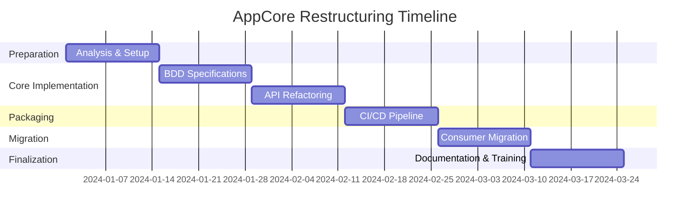

# Plan de Implementación - Restructuración AppCore

## Fase 1: Preparación y Análisis (Semana 1-2)

### 🎯 Objetivos
- Análisis completo de dependencias actuales
- Identificación de APIs públicas vs internas
- Configuración del entorno de desarrollo

### 📋 Tareas

#### Día 1-3: Análisis de Dependencias
- [ ] Mapear todas las dependencias entre AppCore y consumidores
- [ ] Identificar clases/interfaces que deben ser públicas
- [ ] Documentar breaking changes potenciales
- [ ] Crear matriz de compatibilidad

#### Día 4-7: Configuración Base
- [ ] Crear repositorio independiente para AppCore
- [ ] Configurar estructura de carpetas
- [ ] Configurar CI/CD pipeline básico
- [ ] Configurar herramientas de análisis de código

#### Día 8-10: Configuración de Testing
- [ ] Configurar proyectos de pruebas unitarias
- [ ] Configurar SpecFlow para BDD
- [ ] Crear templates de pruebas
- [ ] Configurar coverage tools

### ✅ Entregables
- Repositorio AppCore independiente configurado
- Pipeline CI/CD básico funcionando
- Documentación de arquitectura inicial
- Plan detallado de migración

---

## Fase 2: Implementación BDD Core (Semana 3-4)

### 🎯 Objetivos
- Implementar especificaciones BDD para funcionalidad core
- Establecer cobertura de pruebas base
- Definir contratos de API pública

### 📋 Tareas

#### Semana 3: Especificaciones Core
- [ ] **GenericRepository.feature** - Especificar operaciones CRUD
- [ ] **ResponseWrapper.feature** - Especificar comportamiento de respuestas
- [ ] **ExceptionHandling.feature** - Especificar manejo de errores
- [ ] **HttpService.feature** - Especificar cliente HTTP base

#### Semana 4: Implementación y Validación
- [ ] Implementar step definitions para todas las features
- [ ] Ejecutar y validar todas las especificaciones
- [ ] Crear pruebas de integración básicas
- [ ] Configurar reportes de cobertura

### ✅ Entregables
- Suite completa de especificaciones BDD
- Cobertura de pruebas > 80%
- Documentación de comportamientos esperados
- Step definitions reutilizables

---

## Fase 3: Refactoring y API Design (Semana 5-6)

### 🎯 Objetivos
- Refactorizar código para separar API pública/interna
- Implementar versionado semántico
- Optimizar para empaquetado NuGet

### 📋 Tareas

#### Semana 5: Refactoring API
- [ ] Marcar clases internas con `internal`
- [ ] Documentar API pública con XML docs
- [ ] Crear interfaces de abstracción donde necesario
- [ ] Validar que no hay dependencias circulares

#### Semana 6: Preparación NuGet
- [ ] Configurar metadata de NuGet package
- [ ] Crear build targets personalizados
- [ ] Configurar generación de símbolos
- [ ] Validar estructura del paquete

### ✅ Entregables
- API pública claramente definida
- Código refactorizado y optimizado
- Package configuration completa
- Documentación de API actualizada

---

## Fase 4: Empaquetado y CI/CD (Semana 7-8)

### 🎯 Objetivos
- Implementar pipeline completo de empaquetado
- Configurar publicación automática
- Establecer quality gates

### 📋 Tareas

#### Semana 7: Pipeline Avanzado
- [ ] Configurar MinVer para versionado automático
- [ ] Implementar quality gates (tests, coverage, analysis)
- [ ] Configurar empaquetado multi-target si necesario
- [ ] Configurar publicación a GitHub Packages

#### Semana 8: Publicación y Validación
- [ ] Primera publicación preview a GitHub Packages
- [ ] Configurar publicación a NuGet.org
- [ ] Validar metadata y dependencies del paquete
- [ ] Crear documentación de release process

### ✅ Entregables
- Pipeline CI/CD completo funcionando
- Primer paquete NuGet publicado
- Quality gates establecidos
- Proceso de release automatizado

---

## Fase 5: Migración de Consumidores (Semana 9-10)

### 🎯 Objetivos
- Migrar App.sln para usar AppCore via NuGet
- Validar funcionalidad completa
- Crear herramientas de migración

### 📋 Tareas

#### Semana 9: Migración App.sln
- [ ] Remover ProjectReference a AppCore
- [ ] Agregar PackageReference a OrionSoft.AppCore
- [ ] Validar que toda funcionalidad sigue funcionando
- [ ] Crear tests de integración end-to-end

#### Semana 10: Herramientas y Documentación
- [ ] Crear scripts de migración automática
- [ ] Documentar proceso de upgrade
- [ ] Crear ejemplos de uso
- [ ] Validar rendimiento y compatibilidad

### ✅ Entregables
- App.sln migrado exitosamente
- Scripts de migración automatizada
- Documentación completa de migración
- Ejemplos y samples funcionando

---

## Fase 6: Finalización y Documentación (Semana 11-12)

### 🎯 Objetivos
- Documentación completa de usuario y desarrollador
- Configuración de mantenimiento a largo plazo
- Training y transfer de conocimiento

### 📋 Tareas

#### Semana 11: Documentación
- [ ] Documentación de API completa con ejemplos
- [ ] Guías de migración detalladas
- [ ] Best practices y patterns recomendados
- [ ] Troubleshooting guide

#### Semana 12: Estabilización
- [ ] Revisar y optimizar rendimiento
- [ ] Configurar monitoreo y alertas
- [ ] Preparar roadmap futuro
- [ ] Knowledge transfer al equipo

### ✅ Entregables
- Documentación completa y actualizada
- Sistema de monitoreo configurado
- Roadmap para versiones futuras
- Equipo capacitado en mantenimiento

---

## Métricas de Éxito

### 📊 KPIs por Fase

#### Calidad de Código
- **Cobertura de Tests**: > 80% en todas las fases
- **Complejidad Ciclomática**: < 10 promedio
- **Deuda Técnica**: < 1 hora por 1000 líneas de código
- **Bugs en Producción**: 0 critical, < 2 major por release

#### Performance del Pipeline
- **Tiempo de Build**: < 5 minutos
- **Tiempo de Tests**: < 10 minutos
- **Tiempo de Package**: < 2 minutos
- **Tiempo de Deploy**: < 1 minuto

#### Adopción y Usabilidad
- **Tiempo de Onboarding**: < 30 minutos para nuevos desarrolladores
- **Documentación Coverage**: 100% de APIs públicas documentadas
- **Satisfacción del Desarrollador**: > 8/10 en surveys
- **Tiempo de Resolución de Issues**: < 24 horas para critical

### 🎯 Criterios de Aceptación

#### Para cada Feature
```gherkin
Given una nueva funcionalidad en AppCore
When se implementa siguiendo el proceso BDD
Then debe tener:
  * Especificación BDD completa y ejecutable
  * Pruebas unitarias con > 90% coverage
  * Documentación XML completa
  * Backward compatibility validada
  * Performance benchmark establecido
```

#### Para cada Release
```gherkin
Given un release candidato de AppCore
When se ejecuta el pipeline completo
Then debe pasar:
  * Todas las especificaciones BDD
  * Todas las pruebas unitarias e integración
  * Quality gates de SonarQube
  * Security scan sin critical/high issues
  * Performance tests dentro de SLA
  * Package validation exitosa
```

## Riesgos y Mitigaciones

### 🚨 Riesgos Identificados

| Riesgo | Probabilidad | Impacto | Mitigación |
|--------|-------------|---------|------------|
| Breaking changes no detectados | Media | Alto | Comprehensive testing + gradual rollout |
| Performance degradation | Baja | Alto | Performance benchmarks + monitoring |
| Dependency conflicts | Media | Medio | Central package management + testing |
| Team resistance to change | Media | Medio | Training + gradual adoption |
| CI/CD pipeline failures | Baja | Alto | Redundant systems + rollback plan |

### 🛡️ Plan de Contingencia

1. **Rollback Strategy**: Mantener ProjectReference como fallback durante 1 mes
2. **Hotfix Process**: Pipeline expeditivo para fixes críticos
3. **Support Channel**: Canal dedicado para issues de migración
4. **Documentation**: Troubleshooting guide exhaustivo
5. **Monitoring**: Alertas proactivas en métricas clave

## Timeline Visual

