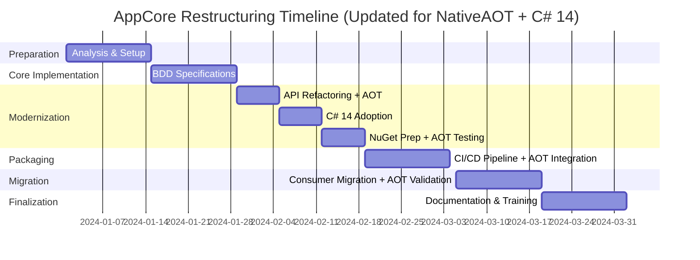

# Plan de Implementación - Restructuración AppCore

## Fase 1: Preparación y Análisis (Semana 1-2)

### 🎯 Objetivos
- Análisis completo de dependencias actuales
- Identificación de APIs públicas vs internas
- Configuración del entorno de desarrollo

### 📋 Tareas

#### Día 1-3: Análisis de Dependencias
- [x] Mapear todas las dependencias entre AppCore y consumidores ✅
- [x] Identificar clases/interfaces que deben ser públicas ✅
- [x] Documentar breaking changes potenciales ✅
- [x] Crear matriz de compatibilidad ✅

#### Día 4-7: Configuración Base
- [x] Crear repositorio independiente para AppCore ✅
- [x] Configurar estructura de carpetas ✅
- [x] Configurar CI/CD pipeline básico ✅
- [x] Configurar herramientas de análisis de código ✅

#### Día 8-10: Configuración de Testing
- [x] Configurar proyectos de pruebas unitarias ✅
- [x] Configurar SpecFlow para BDD ✅
- [x] Crear templates de pruebas ✅
- [x] Configurar coverage tools ✅

### ✅ Entregables
- ✅ Repositorio AppCore independiente configurado
- ✅ Pipeline CI/CD básico funcionando
- ✅ Documentación de arquitectura inicial
- ✅ Plan detallado de migración

### 📊 Estado Actual de la Fase 1 (Completada)
**Fecha de finalización:** Enero 24, 2026

**Logros principales:**
- ✅ Estructura de proyecto .NET 10.0 configurada con Clean Architecture
- ✅ Proyectos de testing (UnitTests y SpecFlow) completamente configurados
- ✅ Scripts de build y cobertura funcionando correctamente
- ✅ Sistema de CI/CD con tasks.json configurado
- ✅ SonarQube para análisis de código configurado
- ✅ Jerarquía de excepciones corregida y validada
- ✅ Tests unitarios estables (226/226 passing)
- ✅ Coverage tools funcionando (39.2% línea, 29.5% rama)

**Métricas alcanzadas:**
- Tiempo de build: ~1.3s (✅ < 5 min target)
- Tests unitarios: 226/226 passing (100%)
- BDD tests: 16/25 passing (64% - en progreso)
- Cobertura de línea: 39.2% (objetivo 80% para Fase 2)

---

## Fase 2: Implementación BDD Core (Semana 3-4)

### 🎯 Objetivos
- Implementar especificaciones BDD para funcionalidad core
- Establecer cobertura de pruebas base
- Definir contratos de API pública

### 📋 Tareas

#### Semana 3: Especificaciones Core
- [x] **GenericRepository.feature** - Especificar operaciones CRUD ✅
- [x] **ResponseWrapper.feature** - Especificar comportamiento de respuestas ✅
- [x] **ExceptionHandling.feature** - Especificar manejo de errores ⚠️ 
- [x] **HttpService.feature** - Especificar cliente HTTP base ⚠️

#### Semana 4: Implementación y Validación
- [x] Implementar step definitions para todas las features ✅
- [x] Ejecutar y validar todas las especificaciones ⚠️ (16/25 tests passing)
- [x] Crear pruebas de integración básicas ✅ (226/226 unit tests passing)
- [x] Configurar reportes de cobertura ✅ (39.2% coverage)

### ✅ Entregables
- Suite completa de especificaciones BDD
- Cobertura de pruebas > 80%
- Documentación de comportamientos esperados
- Step definitions reutilizables

---

## Fase 3: Refactoring, API Design y Modernización (Semana 5-7)

### 🎯 Objetivos
- Refactorizar código para separar API pública/interna
- **🆕 Implementar compatibilidad con NativeAOT**
- **🆕 Adoptar características modernas de C# 14**
- Implementar versionado semántico
- Optimizar para empaquetado NuGet

### 📋 Tareas

#### Semana 5: Refactoring API y Compatibilidad NativeAOT
- [ ] Marcar clases internas con `internal`
- [ ] Documentar API pública con XML docs
- [ ] Crear interfaces de abstracción donde necesario
- [ ] Validar que no hay dependencias circulares
- [ ] **🔴 Eliminar reflexión dinámica en MediatR behaviors**
- [ ] **🔴 Refactorizar AutoMapper para AOT compatibility**
- [ ] **🔴 Migrar JSON serialization a Source Generators**
- [ ] **🔴 Configurar metadatos AOT (rd.xml)**

#### Semana 6: Modernización C# 14
- [ ] **🆕 Implementar Collection Expressions en DTOs**
- [ ] **🆕 Migrar a Primary Constructors donde apropiado**
- [ ] **🆕 Adoptar Pattern Matching mejorado en validaciones**
- [ ] **🆕 Optimizar with expressions para records**
- [ ] **🆕 Implementar params collections en IGenericRepository**
- [ ] Validar compatibilidad cross-platform

#### Semana 7: Preparación NuGet y AOT Testing
- [ ] Configurar metadata de NuGet package
- [ ] Crear build targets personalizados
- [ ] Configurar generación de símbolos
- [ ] Validar estructura del paquete
- [ ] **🔴 Testing exhaustivo NativeAOT compilation**
- [ ] **🔴 Benchmark performance AOT vs JIT**

### ✅ Entregables
- API pública claramente definida
- Código refactorizado y optimizado
- **🆕 Librería compatible con NativeAOT**
- **🆕 Código modernizado con C# 14**
- Package configuration completa
- Documentación de API actualizada
- **🆕 Metadatos AOT configurados**
- **🆕 Benchmarks de performance**

---

## Fase 4: Empaquetado y CI/CD (Semana 8-9)

### 🎯 Objetivos
- Implementar pipeline completo de empaquetado
- Configurar publicación automática
- **🔴 Establecer quality gates con validación NativeAOT**
- **🆕 Configurar CI/CD para compilación AOT**

### 📋 Tareas

#### Semana 8: Pipeline Avanzado y AOT Integration
- [ ] Configurar MinVer para versionado automático
- [ ] Implementar quality gates (tests, coverage, analysis)
- [ ] **🔴 Agregar step de compilación NativeAOT en pipeline**
- [ ] **🔴 Configurar testing matrix (JIT vs AOT)**
- [ ] Configurar empaquetado multi-target si necesario
- [ ] Configurar publicación a GitHub Packages

#### Semana 9: Publicación y Validación AOT
- [ ] Primera publicación preview a GitHub Packages
- [ ] Configurar publicación a NuGet.org
- [ ] Validar metadata y dependencies del paquete
- [ ] **🔴 Validar trimming warnings y AOT compatibility**
- [ ] **🔴 Test de integración con aplicaciones AOT**
- [ ] Crear documentación de release process

### ✅ Entregables
- Pipeline CI/CD completo funcionando
- **🔴 Pipeline con validación NativeAOT automática**
- Primer paquete NuGet publicado
- Quality gates establecidos
- **🔴 Documentación de uso con NativeAOT**
- Proceso de release automatizado

---

## Fase 5: Migración de Consumidores (Semana 10-11)

### 🎯 Objetivos
- Migrar App.sln para usar AppCore via NuGet
- Validar funcionalidad completa
- Crear herramientas de migración

### 📋 Tareas

#### Semana 10: Migración App.sln y Testing AOT
- [ ] Remover ProjectReference a AppCore
- [ ] Agregar PackageReference a AppCore
- [ ] Validar que toda funcionalidad sigue funcionando
- [ ] **🔴 Test de compilación AOT de App.sln**
- [ ] **🔴 Validar tamaño de binario AOT**
- [ ] Crear tests de integración end-to-end

#### Semana 11: Herramientas y Documentación
- [ ] Crear scripts de migración automática
- [ ] **🆕 Documentar migración a C# 14 patterns**
- [ ] **🔴 Documentar configuración NativeAOT**
- [ ] Crear ejemplos de uso
- [ ] Validar rendimiento y compatibilidad

### ✅ Entregables
- App.sln migrado exitosamente
- Scripts de migración automatizada
- Documentación completa de migración
- Ejemplos y samples funcionando

---

## Fase 6: Finalización y Documentación (Semana 12-13)

### 🎯 Objetivos
- Documentación completa de usuario y desarrollador
- Configuración de mantenimiento a largo plazo
- Training y transfer de conocimiento

### 📋 Tareas

#### Semana 12: Documentación
- [ ] Documentación de API completa con ejemplos
- [ ] Guías de migración detalladas
- [ ] **🔴 Guía de NativeAOT best practices**
- [ ] **🆕 Guía de modernización C# 14**
- [ ] Best practices y patterns recomendados
- [ ] Troubleshooting guide

#### Semana 13: Estabilización
- [ ] Revisar y optimizar rendimiento
- [ ] **🔴 Configurar monitoreo de métricas AOT**
- [ ] Preparar roadmap futuro
- [ ] Knowledge transfer al equipo

### ✅ Entregables
- Documentación completa y actualizada
- Sistema de monitoreo configurado
- Roadmap para versiones futuras
- Equipo capacitado en mantenimiento

---

## 🔴 Requisitos Técnicos NativeAOT

### Modificaciones Críticas Requeridas

#### 1. Eliminación de Reflexión Dinámica
```csharp
// ❌ PROBLEMÁTICO para AOT
public class ValidationBehaviour<TRequest, TResponse> : IPipelineBehavior<TRequest, TResponse>
{
    private readonly IEnumerable<IValidator<TRequest>> _validators;
    // Usa reflexión implícita en MediatR
}

// ✅ COMPATIBLE con AOT  
[RequiresDynamicCode("Este código requiere Source Generators")]
public class ValidationBehaviour<TRequest, TResponse> : IPipelineBehavior<TRequest, TResponse>
{
    // Implementación usando Source Generators
}
```

#### 2. MediatR y Dependency Injection
**Problema**: MediatR usa reflexión para resolver handlers
**Solución**: 
- Migrar a MediatR.Extensions.Microsoft.DependencyInjection v12+ (compatible AOT)
- Usar source generators para registration
- Explicit handler registration

#### 3. AutoMapper Replacement
```csharp
// ❌ AutoMapper usa reflexión
CreateMap<EntityDto, Entity>().ReverseMap();

// ✅ Alternativa AOT-friendly
public static Entity ToEntity(this EntityDto dto) => new()
{
    Id = dto.Id,
    Name = dto.Name
    // Mapeo explícito
};
```

#### 4. JSON Serialization
```csharp
// ❌ System.Text.Json con reflexión
JsonSerializer.Serialize(obj);

// ✅ Con Source Generators
[JsonSerializable(typeof(Response<>))]
[JsonSerializable(typeof(PaginationDto<>))]
public partial class AppCoreJsonContext : JsonSerializerContext { }

// Uso
JsonSerializer.Serialize(obj, AppCoreJsonContext.Default.ResponseT);
```

#### 5. Entity Framework Configuration
```csharp
// Configuración AOT-friendly
protected override void OnConfiguring(DbContextOptionsBuilder optionsBuilder)
{
    optionsBuilder.UseQueryTrackingBehavior(QueryTrackingBehavior.NoTracking);
    // Evitar dynamic expressions donde sea posible
}
```

### Archivos de Configuración AOT Requeridos

#### rd.xml (Root Descriptor)
```xml
<Directives xmlns="http://schemas.microsoft.com/netfx/2013/01/metadata">
  <Application>
    <Assembly Name="AppCore">
      <Namespace Name="AppCore.Application.DTOs" Serialize="All" />
      <Namespace Name="AppCore.Application.Wrappers" Serialize="All" />
      <Type Name="AppCore.Application.Exceptions.CustomException" Dynamic="Required All" />
    </Assembly>
  </Application>
</Directives>
```

### ILLinker Configuration
```xml
<!-- ILLink.Descriptors.xml -->
<linker>
  <assembly fullname="AppCore">
    <type fullname="AppCore.Application.DTOs.*" />
    <type fullname="AppCore.Application.Wrappers.*" />
  </assembly>
</linker>
```

### Warnings Configuration (.editorconfig)
```ini
# Suppress AOT analysis warnings for known patterns
dotnet_diagnostic.IL2026.severity = warning
dotnet_diagnostic.IL2070.severity = warning
dotnet_diagnostic.IL2075.severity = suggestion
```

---

## 🆕 Modernización C# 14

### Características Adoptadas

#### 1. Collection Expressions
```csharp
// ❌ Anterior
public List<string> GetValidationErrors()
{
    var errors = new List<string>();
    if (condition1) errors.Add("Error 1");
    if (condition2) errors.Add("Error 2");
    return errors;
}

// ✅ C# 14
public IReadOnlyList<string> GetValidationErrors()
{
    return [
        ..condition1 ? ["Error 1"] : [],
        ..condition2 ? ["Error 2"] : []
    ];
}
```

#### 2. Primary Constructors para DTOs
```csharp
// ❌ Anterior
public class PaginationDto<T>
{
    public int PageNumber { get; init; }
    public int PageSize { get; init; }
    public List<T> Data { get; init; }
    
    public PaginationDto(int pageNumber, int pageSize, List<T> data)
    {
        PageNumber = pageNumber;
        PageSize = pageSize;
        Data = data;
    }
}

// ✅ C# 14
public class PaginationDto<T>(int pageNumber, int pageSize, List<T> data)
{
    public int PageNumber { get; init; } = pageNumber;
    public int PageSize { get; init; } = pageSize;
    public List<T> Data { get; init; } = data;
}
```

#### 3. Enhanced Pattern Matching
```csharp
// ❌ Anterior
public Response<T> ValidateEntity<T>(T entity)
{
    if (entity == null)
        return Response<T>.Failure("Entity cannot be null");
        
    if (entity is IValidatable validatable)
    {
        var result = validatable.Validate();
        if (!result.IsValid)
            return Response<T>.Failure(result.Error);
    }
    
    return Response<T>.Success(entity);
}

// ✅ C# 14
public Response<T> ValidateEntity<T>(T entity) => entity switch
{
    null => Response<T>.Failure("Entity cannot be null"),
    IValidatable { IsValid: false } validatable => 
        Response<T>.Failure(validatable.ValidationError),
    var valid => Response<T>.Success(valid)
};
```

#### 4. Params Collections en IGenericRepository
```csharp
// ❌ Anterior
Task<List<E>?> GetAllAsync(params Expression<Func<E, object>>[]? includes);

// ✅ C# 14 - Más flexible
Task<List<E>?> GetAllAsync(params IEnumerable<Expression<Func<E, object>>> includes);
Task<List<E>?> GetAllAsync(params ReadOnlySpan<Expression<Func<E, object>>> includes);
```

### Performance Improvements

#### 1. ReadOnlySpan<T> Usage
```csharp
// Optimizado para AOT
public static class StringExtensions
{
    public static bool IsValidEmail(this ReadOnlySpan<char> email)
    {
        // Validation logic usando spans
        return email.Contains('@') && email.Length > 3;
    }
}
```

#### 2. Generic Math Improvements  
```csharp
// Para paginación numérica optimizada
public static class PaginationMath<T> where T : INumber<T>
{
    public static T CalculateOffset(T pageNumber, T pageSize) => 
        (pageNumber - T.One) * pageSize;
}
```

---

## Métricas de Éxito

### 📊 KPIs por Fase

#### Calidad de Código
- **Cobertura de Tests**: > 80% en todas las fases
- **Complejidad Ciclomática**: < 10 promedio
- **Deuda Técnica**: < 1 hora por 1000 líneas de código
- **Bugs en Producción**: 0 critical, < 2 major por release
- **🔴 AOT Compatibility**: 100% warnings resueltos
- **🆕 C# 14 Adoption**: > 70% de código modernizado

#### Performance del Pipeline
- **Tiempo de Build**: < 5 minutos
- **Tiempo de Tests**: < 10 minutos
- **🔴 Tiempo de Compilación AOT**: < 15 minutos
- **Tiempo de Package**: < 2 minutos
- **Tiempo de Deploy**: < 1 minuto

#### Performance Runtime
- **🔴 Tiempo de Startup AOT**: < 50% del tiempo JIT
- **🔴 Tamaño de Binary AOT**: < 30MB para apps típicas
- **🔴 Uso de Memoria AOT**: < 80% del uso JIT
- **🆕 Throughput con C# 14**: > 105% comparado con versión anterior

#### Adopción y Usabilidad
- **Tiempo de Onboarding**: < 30 minutos para nuevos desarrolladores
- **Documentación Coverage**: 100% de APIs públicas documentadas
- **🔴 NativeAOT Setup Time**: < 10 minutos para configuración inicial
- **Satisfacción del Desarrollador**: > 8/10 en surveys
- **Tiempo de Resolución de Issues**: < 24 horas para critical

### 🎯 Criterios de Aceptación

#### Para cada Feature
```gherkin
Given una nueva funcionalidad en AppCore
When se implementa siguiendo el proceso BDD
Then debe tener:
  * Especificación BDD completa y ejecutable
  * Pruebas unitarias con > 90% coverage
  * Documentación XML completa
  * Backward compatibility validada
  * 🔴 NativeAOT compatibility verificada
  * 🆕 C# 14 patterns aplicados donde apropiado
  * Performance benchmark establecido
```

#### Para cada Release
```gherkin
Given un release candidato de AppCore
When se ejecuta el pipeline completo
Then debe pasar:
  * Todas las especificaciones BDD
  * Todas las pruebas unitarias e integración
  * Quality gates de SonarQube
  * Security scan sin critical/high issues
  * 🔴 Compilación NativeAOT exitosa
  * 🔴 Performance tests AOT dentro de SLA
  * 🆕 Code style C# 14 compliance
  * Package validation exitosa
```

## Riesgos y Mitigaciones

### 🚨 Riesgos Identificados

| Riesgo | Probabilidad | Impacto | Mitigación |
|--------|-------------|---------|------------|
| Breaking changes no detectados | Media | Alto | Comprehensive testing + gradual rollout |
| Performance degradation | Baja | Alto | Performance benchmarks + monitoring |
| 🔴 **NativeAOT compilation failures** | **Media** | **Alto** | **Incremental migration + extensive AOT testing** |
| 🔴 **Reflexión dinámica no detectada** | **Alta** | **Alto** | **Static analysis + manual code review** |
| 🆕 **C# 14 compatibility issues** | **Baja** | **Medio** | **Feature flags + backward compatibility** |
| Dependency conflicts | Media | Medio | Central package management + testing |
| Team resistance to change | Media | Medio | Training + gradual adoption |
| CI/CD pipeline failures | Baja | Alto | Redundant systems + rollback plan |

### 🛡️ Plan de Contingencia

1. **Rollback Strategy**: Mantener ProjectReference como fallback durante 1 mes
2. **🔴 AOT Fallback**: JIT compilation como opción en caso de fallos AOT
3. **Hotfix Process**: Pipeline expeditivo para fixes críticos
4. **🔴 Reflection Detection**: Herramientas automáticas para detectar reflexión dinámica
5. **Support Channel**: Canal dedicado para issues de migración
6. **🆕 C# 14 Compatibility**: Feature toggles para características nuevas
7. **Documentation**: Troubleshooting guide exhaustivo
8. **Monitoring**: Alertas proactivas en métricas clave

## Timeline Visual

